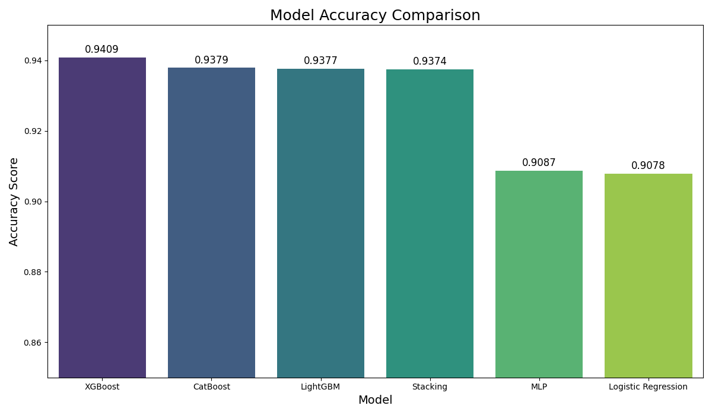

#  Dementia Prediction from Non-Medical Factors

This project uses machine learning to predict dementia in patients based on a large set of non-medical, demographic, and functional assessment data. The goal is to build a highly accurate binary classification model.

The final optimized **XGBoost** model achieved **93.51% accuracy** on the unseen test data.

---

## Dataset

The data for this project is a subset of the National Alzheimer's Coordinating Center (NACC) dataset.

* **File:** `Dataset.csv`
* **Initial Shape:** 195,196 patient visit records × 1024 features
* **Cleaned Shape:** 195,196 records × 93 selected non-medical features
* **Target:** `DEMENTED` (1 for Demented, 0 for Not Demented)

The file `Data Dictionary marked.pdf` was used for all feature engineering and selection steps.

---

## Project Workflow

This project followed a 7-step machine learning workflow:

1.  **Data Exploration & Understanding:** Analyzed over 1,000 initial features. Used the data dictionary to identify non-medical factors, leading to a 93-feature subset.
2.  **Feature Engineering & Selection:**
    * **Dropped Leaky Features:** Removed 17 features that are part of a diagnosis (e.g., `NACCDIED`, `NACCAUTP`, `NACCACSF`), as they "leak" the answer to the model.
    * **Dropped Redundant Features:** Removed 19 features that were summarized by others (e.g., dropped all 15 individual GDS questions in favor of the total score, `NACCGDS`; dropped `HEIGHT` and `WEIGHT` in favor of `NACCBMI`).
3.  **Data Preprocessing:**
    * Built a `scikit-learn` **Pipeline** to prevent data leakage during training.
    * **Numerical Features:** Imputed missing values with `median` and scaled using `StandardScaler`.
    * **Categorical Features:** Imputed missing values with `most_frequent` and encoded using `OneHotEncoder`.
4.  **Model Development:**
    * Trained and compared 7 different models: `LogisticRegression`, `LGBMClassifier`, `XGBClassifier`, `CatBoostClassifier`, `MLPClassifier` (Neural Network), and a `StackingClassifier`.
5.  **Hyperparameter Tuning:**
    * Used `GridSearchCV` with 3-fold cross-validation on the 80% training set to find the optimal parameters for each model.
6.  **Model Evaluation:**
    * Compared the final `Accuracy` score of all optimized models on the 20% hold-out test set.
7.  **Explainability & Insights:**
    * Analyzed the `feature_importances_` of the winning model (XGBoost) to understand *which factors* were the most predictive.

---

## Model,Test Set Accuracy

XGBoost --------------------> 94.09%

CatBoost -------------------> 93.79%

LightGBM -------------------> 93.77%

StackingClassifier----------> 93.74%

MLP (Neural Net) -----------> 90.87%

Logistic Regression --------> 90.78%

